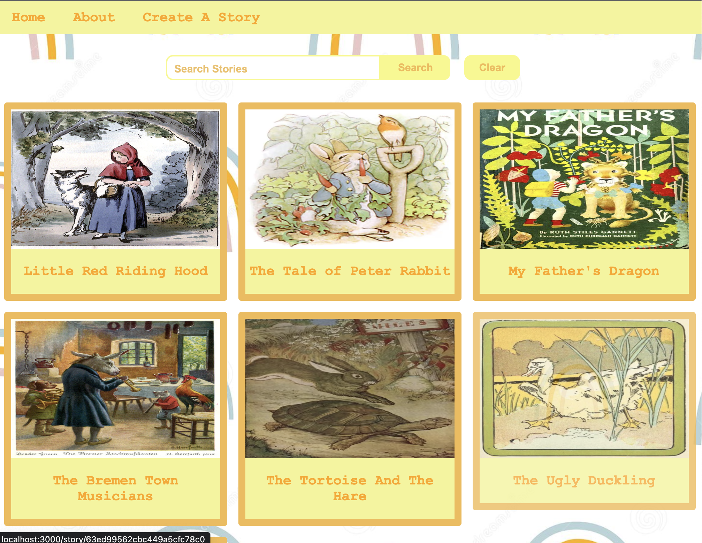
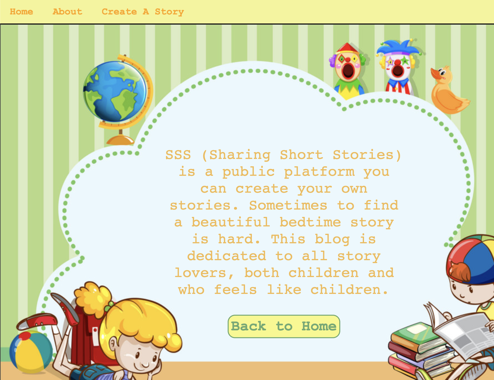
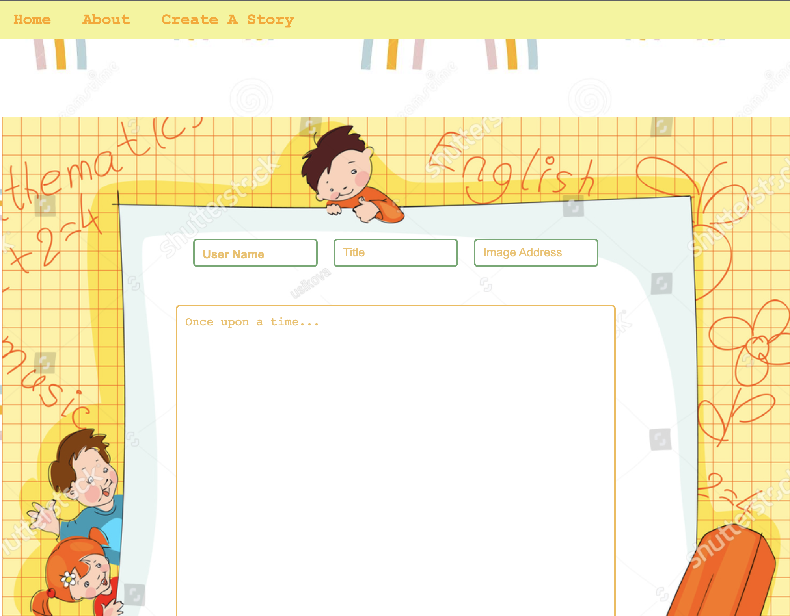

# SSS (Share Short Stories)

## Date: 02/08/2023

---

## By: Hatice Tuba Yorukoglu

[LinkedIn](https://www.linkedin.com/feed/) |
[Github](https://github.com/hatuceka) |
[Instagram](https://instagram.com/iamhaticetuba?igshid=YmMyMTA2M2Y=)

---

**_Description_**

SSS-Share Your Stories is a public short story sharing platform for kids. The purpose is to provide free content for parents who love to read their children different stories. Anyone can submit a story or a comment to the story with a username. The stories on the website are open to everyone, and can't be edited. However, comments can be updated or deleted anytime by anyone.

---

---

**_Technologies Used_**

- Mongo DB
- Express
- React
- Node.js
- Javascript

---

**_Getting Started_**

#### **Rules for The Stories**

The stories should:

1. be appropriate for kids.
2. not be a copy of a copyrighted material.

---

---

#### **Rules for The Users**

The users should:

1. have all the responsibilities for what they write.
2. know that this is a free platform, so, no copyright!

---

---

**_Future Updates_**

- [ ] Like and comment buttons for comments
- [ ] Accounts for users
- [ ] Category buttons to update stories according to category
- [ ] Audio and video story options

---

**_Credits_**

Project Planning: [Trello](https://trello.com/b/fzKTisxp/project-share-short-stories)

Component Hierarchy Diagram: [Lucid App](https://lucid.app/lucidchart/d7b3638e-dad9-4270-b9db-3bd74cfd75ff/edit?invitationId=inv_2a8e021b-8016-4002-b4d4-fdfcf5dacd0c&page=0_0#)

ERD: [DrawIO](https://app.diagrams.net/#)
